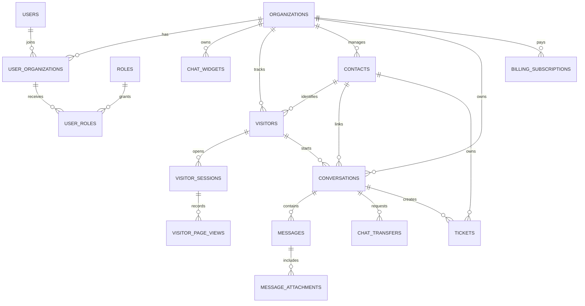

# Database Design

## Overview

The database is tenant-first. Most operational records include `organization_id`, and every API query should scope by organization before applying business filters. Global `users` represent login identities; organization-specific permissions and agent state live in `user_organizations`, `roles`, and `user_roles`.

The canonical deployable schema is `packages/database/prisma/migrations/000001_initial_schema/migration.sql`.

## Core Areas

| Area | Tables |
| --- | --- |
| Tenant and auth | `organizations`, `users`, `auth_provider_identities`, `refresh_tokens`, `user_organizations`, `roles`, `user_roles`, `invitations` |
| Routing and teams | `departments`, `department_agents`, `chat_widgets` |
| Visitor tracking | `visitors`, `visitor_sessions`, `visitor_page_views`, `visitor_events` |
| Realtime chat | `conversations`, `conversation_participants`, `messages`, `message_attachments`, `message_delivery_receipts`, `conversation_assignments`, `chat_transfers` |
| Productivity | `canned_response_categories`, `canned_responses` |
| CRM | `contacts`, `tags`, `contact_tags`, `contact_notes` |
| Tickets | `tickets`, `ticket_comments`, `ticket_events` |
| Notifications | `email_templates`, `notifications`, `webhook_endpoints` |
| Billing | `billing_plans`, `billing_customers`, `billing_subscriptions`, `billing_invoices` |
| Analytics and admin | `analytics_daily_metrics`, `api_keys`, `audit_logs` |

## Entity Relationships

## Tenant Isolation

- API guards must resolve the active organization from route context, subdomain, or membership selection.
- Queries must include `organization_id` for all tenant-scoped resources.
- Cross-tenant joins should be rejected at the service layer and audited when suspicious.
- Public widget access uses `chat_widgets.public_key`; internal writes still resolve to an organization.

## Chat Lifecycle

1. A visitor opens a widget and receives a `visitor_sessions.session_token`.
2. Page views and custom events are appended to visitor tracking tables.
3. The first chat message creates a `conversations` record in `QUEUED` status.
4. Routing assigns an agent through `conversation_assignments` and updates `conversations.assigned_agent_id`.
5. Messages are inserted into `messages`; attachments are stored in `message_attachments`.
6. Socket.IO broadcasts are emitted after persistence, using `messages.idempotency_key` to reconcile retries.
7. Transfers append `chat_transfers` records and create a new assignment when accepted.
8. Resolved conversations remain queryable for history, analytics, CRM, and tickets.

## CRM and Tickets

- Visitors are anonymous until they provide identity data or an agent links them to a contact.
- `contacts` store durable CRM identity; `visitors` store browser/session identity.
- `tickets` can link to a contact, visitor, conversation, and assignee.
- `ticket_events` provide an audit-style timeline for state transitions and automation.

## Billing

- Stripe customer, subscription, invoice, and price identifiers are stored locally.
- `organizations.status` and `billing_subscriptions.status` together determine product access.
- Partial indexes keep only one current active-like subscription per organization.

## Analytics

Operational tables remain the source of truth. `analytics_daily_metrics` stores daily rollups by organization, department, and agent for dashboard speed.

## Integrity Rules

- Foreign keys use cascading deletes for tenant teardown and child records that cannot exist independently.
- User, contact, and conversation records prefer soft deletion where history matters.
- Trigger-managed `updated_at` columns keep writes consistent across Prisma and raw SQL.
- Partial unique indexes enforce open invitations, active subscriptions, and non-deleted contact email uniqueness.
